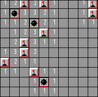

# MineSweeper
Designed a Minesweeper and an autonomous AI agent that plays on its own to solve the board. The AI agent makes use of information learned by itself on the board and tries to determine new clues about its next steps. The more steps the agent take, the more it will learn about the board and try to determine correctly which cell would be a mine and can be flagged and which cell is a safe cell to proceed on. In this case, the game will not stop if the AI agent goes to a cell that is a mine, instead it will use that information for its other moves. The algorithms implemented primarily makes use of inference rules and treats the problem as a constraint satisfaction problem, depending primarily all information gathering from a logical point of view, the reason why inference rules are used.
<p align="center">
  
</p>

## Installing & Running
Download the complete project in one folder, import project in your IDE, compile and run.

## For command line
```
open cmd
Navigate to directory
run python
python main.py
```

## Must have Installed
Numpy
<br>
Pygame

